<div align="center">


<a href="https://github.com/Deepanshu-8126">

</a>

<p>
<a href="https://linkedin.com/in/deepanshu-kapri"></a>
<a href="mailto:deepanshukapri8126@gmail.com"></a>

<a href="https://github.com/Deepanshu-8126?tab=followers"></a>
</p>


</div>

<br/>

## 👨‍💻 About Me

<table>
<tr>
<td width="58%" valign="top">

```python
class DeepanshuKapri:
    name      = "Deepanshu Kapri"
    role      = "Aspiring Data Scientist"
    education = "BCA Student"

    languages = ["Python", "SQL"]
    tools     = ["Pandas", "NumPy", "Matplotlib", "Seaborn",
                 "Scikit-Learn", "Power BI", "Excel"]
    focus     = ["Data Analysis", "Machine Learning",
                 "Statistical Modeling", "Visualization"]

    mindset   = "Learn → Build → Analyze → Improve"
    goal      = "Transform raw data into business impact 🚀"
```

</td>
<td width="42%" align="center">

</td>
</tr>
</table>

- 🎓 Pursuing **BCA**, focused on data science & analytics
- 📊 I love turning messy datasets into **clear dashboards and stories**
- 🤖 Currently diving deep into **Machine Learning & Statistics**
- 📫 Reach me at **deepanshukapri8126@gmail.com**

<br/>

## ⚡ Tech Stack

<div align="center">


<br/><br/>

| Category | Tools |
|:--:|:--|
| **🐍 Data & Analysis** |     |
| **🤖 Machine Learning** |  |
| **🗄️ Databases** |     |
| **📊 BI & Visualization** |    |
| **⚙️ Environment** |     |

</div>

<br/>

## 🌐 Full Stack Interest *(Exploring)*

> Data is my main focus, but I also enjoy building full-stack apps and know the basics of the tools below.

<div align="center">


<br/><br/>

| Category | Tools |
|:--:|:--|
| **⚛️ MERN Stack** |     |
| **🔧 Backend** |    |
| **☁️ Cloud Databases** |      |
| **🚀 Deploy** |    |

</div>

<br/>

## 🧠 My Data Workflow

```mermaid
flowchart LR
    A[📥 Collect] --> B[🧹 Clean]
    B --> C[🔍 Explore / EDA]
    C --> D[📊 Analyze]
    D --> E[🤖 Model]
    E --> F[📈 Insights]
    F --> G[🚀 Business Impact]
    style A fill:#0D1117,stroke:#00E5FF,color:#fff
    style B fill:#0D1117,stroke:#00E5FF,color:#fff
    style C fill:#0D1117,stroke:#7C3AED,color:#fff
    style D fill:#0D1117,stroke:#7C3AED,color:#fff
    style E fill:#0D1117,stroke:#C084FC,color:#fff
    style F fill:#0D1117,stroke:#C084FC,color:#fff
    style G fill:#7C3AED,stroke:#00E5FF,color:#fff
```

<div align="center">



</div>

<br/>

## 🎯 Current Focus

<div align="center">

| 📚 Learning | 🛠️ Building | 🚀 Improving |
|:--:|:--:|:--:|
| Advanced SQL | Analytics Projects | Problem Solving |
| Statistics | Power BI Dashboards | Business Thinking |
| Machine Learning | ML Models | Data Visualization |
| Power BI | SQL Projects | Clean Code |
| Data Storytelling | End-to-End Workflows | Documentation |

</div>

<br/>

## 🏅 Skill Levels

<div align="center">


</div>

<br/>

## 📈 GitHub Analytics

<div align="center">

<!-- Auto-generated daily by .github/workflows/profile-cards.yml (no rate limits) -->


</div>

<br/>

## 🐍 Contribution Snake

<div align="center">
<picture>
  <source media="(prefers-color-scheme: dark)" srcset="https://raw.githubusercontent.com/Deepanshu-8126/Deepanshu-8126/output/github-contribution-grid-snake-dark.svg"/>
  <source media="(prefers-color-scheme: light)" srcset="https://raw.githubusercontent.com/Deepanshu-8126/Deepanshu-8126/output/github-contribution-grid-snake.svg"/>
  
</picture>
</div>

<br/>

## 🔗 Let's Connect

<div align="center">

<a href="https://github.com/Deepanshu-8126"></a>
<a href="https://linkedin.com/in/deepanshu-kapri"></a>
<a href="mailto:deepanshukapri8126@gmail.com"></a>

<br/><br/>

> *"Data becomes powerful when you transform numbers into decisions and insights into impact."*


</div>
